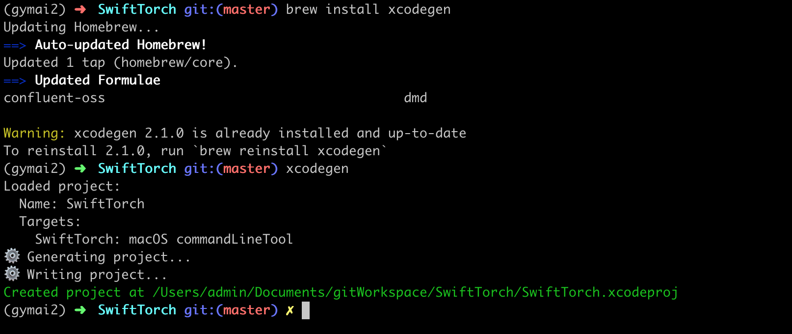
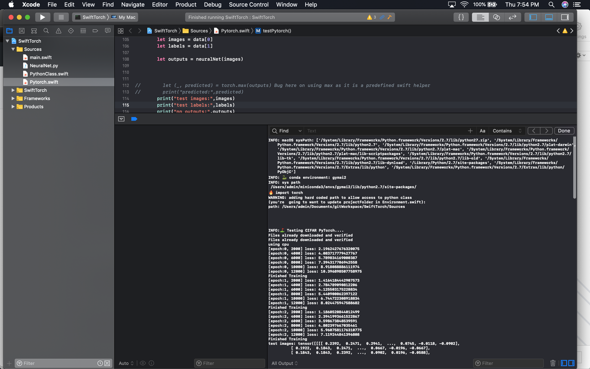

#  SwiftTorch

## Install Swift for Tensorflow
This project is based on Swift for Tensorflow. To install Swift for Tensorflow visit [https://github.com/tensorflow/swift/](https://github.com/tensorflow/swift/blob/master/Installation.md).
/Library/Developer/Toolchains/swift-latest/usr/lib/swift/macosx

**XcodeGen**
Creating new xcode Projects using XcodeGen (project.yml/debug.xcconfig)      
https://github.com/johndpope/swift-models/tree/stable/Inference     

 1. In the menu bar, select `File > Project Settings...`.
 2. Then, select `Legacy Build System` for Build Settings and click `Done`.
 

## Install OpenAI Gym
Take the following steps to install OpenAI Gym using Conda:

      
     
## Install these for gymai
(if sdl2 fails / try proceeding without it)
```
brew install cmake boost boost-python sdl2 swig wget
```


## CONDA     - critical use 2.7.9 to avoid missing python symbols  (__PyCodecInfo_GetIncrementalDecoder)     
https://conda.io/docs/_downloads/conda-cheatsheet.pdf     

      
**Setting up miniconda**      
brew install wget      
wget https://repo.continuum.io/miniconda/Miniconda3-latest-MacOSX-x86_64.sh      
chmod +x Miniconda3-latest-MacOSX-x86_64.sh      
./Miniconda3-latest-MacOSX-x86_64.sh      
      
      
**Add conda to user path**      
for zsh       
code ~/.zshrc      
export PATH="/Users/YOURUSERNAMENAMEHERE/miniconda3/bin:$PATH"      
RESTART TERMINAL!!      


```
// https://conda.io/miniconda.html 
conda create -n gymai2  python=2.7.9
conda activate gymai2
pip install --upgrade pip
pip install "gym[atari]"
pip install sklearn

# for pytorch
pip install Cython 
pip install torch
pip install torchvision

```


     
 // IMPORTANT - hack required to get  torchvision   to load testing / training data used in pytorch.swift
 // in your Users/admin/miniconda3/envs/gymai2/lib/python2.7/site-packages/
 // rename torchvision-0.2.1-py2.7.egg file to .zip - extract out torch ision folder to site-packages
     
     
To connect the conda environment / (which has been activated) - we need to configure  
         
schema >  Run > Pre-actions


```
conda activate gymai2
```


(iterm2 / to see which python environment is activated / as well as which git branch you're on - I recommend using zsh / oh-my-zsh https://github.com/robbyrussell/oh-my-zsh)





**Troubleshooting**    
if you see     
Fatal error: 'try!' expression unexpectedly raised an error: Python exception: dlopen(/Users/johndpope/miniconda3/lib/python2.7/lib-dynload/_io.so, 2): Symbol not found:      
__PyCodecInfo_GetIncrementalDecoder    
     
try source activate gymai
 

